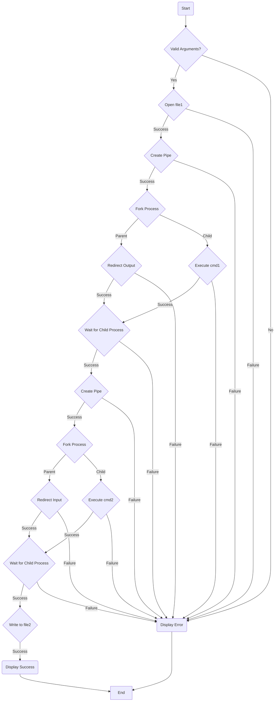
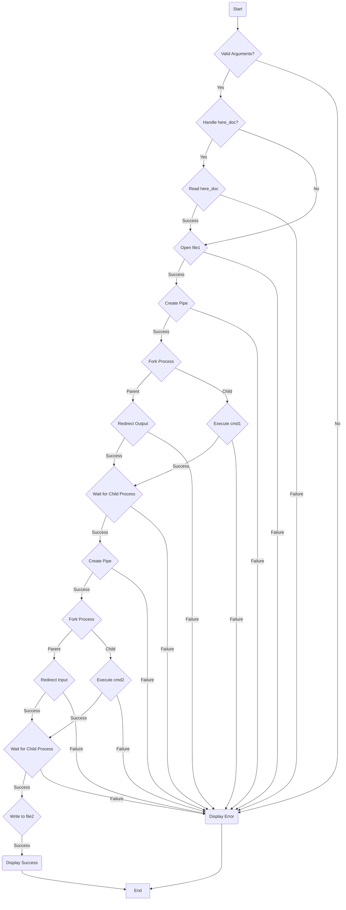

**Pipex**

Pipex is a project from the 42 coding school that involves handling pipes and executing shell commands. The objective is to create a program that replicates the behavior of the following shell command:

```
$> < file1 cmd1 | cmd2 > file2
```

The program, named `pipex`, takes four arguments:

```
./pipex file1 cmd1 cmd2 file2
```

- `file1` and `file2` are file names.
- `cmd1` and `cmd2` are shell commands with their parameters.

The program's execution should be equivalent to the shell command, with the input file `file1` being redirected to the first command `cmd1` via `<`, the output of `cmd1` being piped to `cmd2`, and the final result being redirected to the output file `file2` via `>`.

**Examples:**

```
$> ./pipex infile "ls -l" "wc -l" outfile
```
Should behave like: `< infile ls -l | wc -l > outfile`

```
$> ./pipex infile "grep a1" "wc -w" outfile
```
Should behave like: `< infile grep a1 | wc -w > outfile`

**Requirements:**

- The project should include a Makefile that compiles the source files without relinking.
- Thorough error handling is required to prevent unexpected program termination (e.g., segmentation fault, bus error, double free, etc.).
- The program must not have memory leaks.
- The handling of errors should follow the same approach as the shell command `< file1 cmd1 | cmd2 > file2`.
- The project should include a `libft` library.

**Bonus Part:**

Extra points can be earned by implementing the following additional features:

- Handling multiple pipes:
```
$> ./pipex file1 cmd1 cmd2 cmd3 ... cmdn file2
```
Should behave like: `< file1 cmd1 | cmd2 | cmd3 ... | cmdn > file2`

- Supporting `<<` and `>>` when the first parameter is `"here_doc"`:
```
$> ./pipex here_doc LIMITER cmd cmd1 file
```
Should behave like: `cmd << LIMITER | cmd1 >> file`

**Flowchart:**

Flowcharts for the mandatory and bonus parts of the `pipex` program:

**Mandatory Part:**



**Bonus Part:**



These flowcharts provide a visual representation of the control flow and decision-making process in the `pipex` program, highlighting the steps involved in handling the mandatory and bonus functionalities.
